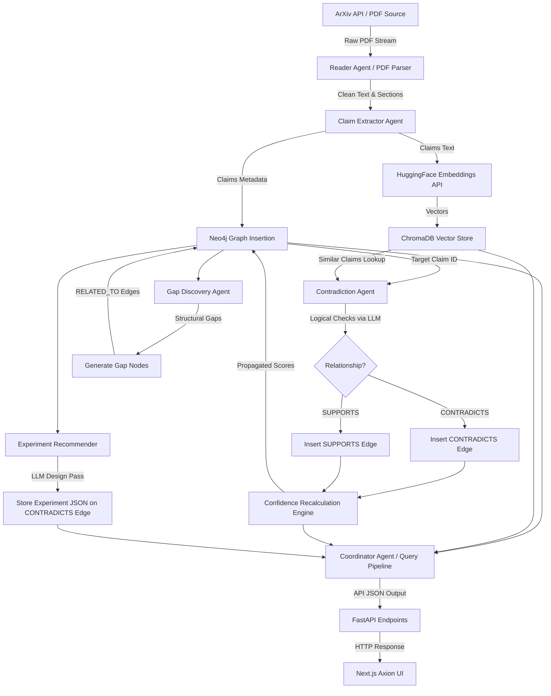

# AXION: Technical Architecture & Scientific Intelligence Specification
**System Version:** v2.30  
**Data Tier:** Neo4j Property Graph + ChromaDB Vector Store  
**Backend:** Python 3.10+ / FastAPI  
**Frontend:** Next.js 16 (React / TypeScript / Tailwind CSS)  
**Security Classification:** Proprietary Internal Engineering Specification  

---

## 1. Project Overview

### 1.1 Intent and Core Function
AXION is a multi-agent scientific intelligence system designed to ingest, process, synthesize, and reason over scientific literature. Unlike traditional search engines or document retrieval systems, AXION operates at the granularity of atomic empirical assertions rather than document-level text blocks. The system's primary capability is the construction, maintenance, and query of a semantic claims network that maps the consensus, contradictions, and unexplored areas across frontier scientific publications.

### 1.2 The Problem of Literature Overload
In frontier domains, such as machine learning and biophysics, the volume of preprints and peer-reviewed papers grows exponentially. Human researchers face significant friction when trying to:
1. **Track Empirical Consistency:** Detect when newly published empirical results conflict with established findings.
2. **Synthesize Consensus:** Discern whether a claim is backed by independent replications or stands in isolation.
3. **Locate Research Gaps:** Find regions of parameter space, datasets, or experimental methodologies that have not been investigated.
4. **Identify Methodological Flaws:** Determine if conflicting claims arise from unstated assumptions, scale differences, or data distribution shifts.

### 1.3 What AXION Is Not
To maintain appropriate product boundaries, AXION is explicitly distinguished from the following systems:
* **Not a Chatbot:** It does not operate as a conversational agent or generate text from unstructured web searches.
* **Not a Simple RAG System:** It does not perform basic top-k chunk retrieval to feed into a generation prompt.
* **Not a Paper Summarizer:** It does not generate paragraph-level summaries of individual PDFs.

### 1.4 What AXION Is
AXION is designed and engineered as:
* **A Multi-Agent Scientific Reasoning Environment:** An orchestration layer of specialized agents that analyze, reflect, and audit claim relationships.
* **A Continuously Evolving Knowledge Graph:** A graph structure where nodes represent papers, claims, and research gaps, and edges represent verifiable semantic and logical connections.
* **An Infrastructure Platform:** A back-end and front-end architecture optimized for structural queries, temporal analysis, and empirical conflict resolution.

---

## 2. Core Objectives

The AXION codebase is built to achieve the following operational capabilities:
* **Ingest Scientific Papers:** Download PDFs (primarily from ArXiv) matching specific search parameters, parse text sections, and resolve structural citation metadata.
* **Extract Atomic Claims:** Deconstruct paper bodies into discrete, falsifiable, and parameters-scoped empirical statements.
* **Structure Scientific Knowledge:** Map papers, authors, claims, datasets, and variables into a property graph database (Neo4j).
* **Detect Contradictions:** Compare claim pairs using embedding-driven similarity filters followed by LLM-backed logical audit cycles to identify conflicting conclusions.
* **Propagate Confidence:** Programmatically adjust the belief score of a claim based on incoming supporting or contradicting relationships across the entire graph topology.
* **Identify Research Gaps:** Locate structural holes, isolated claims, and logical contradictions to auto-generate open research questions.
* **Recommend Resolving Experiments:** Design minimal, high-throughput, and academically feasible evaluation protocols that can resolve detected disputes.
* **Track Temporal Scientific Evolution:** Analyze shift in scientific consensus over time by mapping claim confidence, publication dates, and empirical drift.

```
Traditional Document Retrieval            AXION Scientific Reasoning Infrastructure
┌─────────────────────────────┐           ┌──────────────────────────────────────────┐
│  Keyword / Semantic query   │           │      Query Deconstruction & Planning     │
│             ▼               │           │                     ▼                    │
│   Top-K Text Chunk Match    │   VS      │  Claims Extraction & Semantic Alignment  │
│             ▼               │           │                     ▼                    │
│   Summarized Document Output│           │  Logical Contradiction & Consensus Maps  │
│                             │           │                     ▼                    │
│  (No logic check / source   │           │   Confidence Propagation & Gap Mining    │
│   conflict resolution)      │           │                     ▼                    │
│                             │           │ Synthesis Report with Verifiable Rel-Map │
└─────────────────────────────┘           └──────────────────────────────────────────┘
```

---

## 3. System Philosophy

### 3.1 Ground Principles of Operation
1. **Structured Claims Over Raw Text:** Scientific logic cannot be reliably executed over raw document strings. Information must be decomposed into typed assertions containing independent variables, dependent variables, and directional findings.
2. **Evidence-First Reasoning:** A claim is only as valid as its supporting empirical network. Unsupported claims default to baseline confidence, while contradicted claims suffer programmatic penalties.
3. **Uncertainty Awareness:** Every claim, contradiction, and generated report contains explicit, calculated confidence values. Perfect consensus is treated as highly probable, not absolute truth.
4. **Contradiction-Driven Exploration:** Progress in scientific research occurs at the boundaries of disagreement. AXION treats contradictions not as search failures, but as high-value nodes that anchor gap generation and experiment design.
5. **Graph-Native Analysis:** Scientific literature is a network. Traversal, clustering, and path-finding in graph topologies are superior to vector search alone for multi-hop scientific reasoning.

### 3.2 Scientific Reasoning vs. Semantic Search
Semantic search retrieves documents based on linguistic overlap. It cannot detect if two papers using different terminology describe the same underlying mechanism, nor can it identify when they arrive at opposite empirical conclusions. AXION bridges this gap by decoupling semantic matching (ChromaDB) from logical checking (LLM-driven Agent Auditing).

---

## 4. Current Project Status

### 4.1 Production Metrics (Neo4j Baseline)
The active deployment tracks the following statistics within the primary Neo4j database:
* **Papers Ingested:** 9 (Frontier Deep Learning / Prompting Publications)
* **Claims Extracted:** 270 (Empirical statements with parameter scopes)
* **Contradictions Identified:** 48 (Validated logical conflicts)
* **Research Gaps Identified:** 18 (Topology gaps and contradiction-derived open questions)
* **Experiment Designs Generated:** 36 (Stored directly on `CONTRADICTS` relationships)

### 4.2 Module Maturity Assessment
* **Ingestion Pipeline:** *Stable.* PDF extraction, section segmentation, and claim loading into Neo4j and ChromaDB operate with high reliability.
* **Graph Architecture:** *Stable.* Driver connection pooling and Cypher index optimizations are fully operational.
* **Contradiction Engine:** *Calibrating.* Embedding distances successfully prune comparisons, but LLM logical checking suffers from occasional false positives due to minor scale differences.
* **Confidence Propagation:** *Calibrating.* Programmatic score propagation executes correctly, but requires tuning to prevent dominant source bias.
* **Timeline and Graph Visualization:** *Active.* Immersive front-end renders real-time graph nodes, temporal consensus charts, and active ingestion logs.

---

## 5. Complete Architecture

### 5.1 System Tier Configuration
AXION is structured in a decoupled three-tier architecture:
1. **Frontend (Axion):** React Next.js application that provides the workspace environment, force-directed graph controls, contradiction browsers, and a command terminal.
2. **Backend (FastAPI):** Python application that exposes API endpoints, runs background ingestion threads, and wraps the Python agents.
3. **Database Tier:**
   * **Neo4j 5.x:** Property graph storing structural entities and logical relationships.
   * **ChromaDB 0.5+:** Vector database mapping claim texts to vector representations for fast semantic lookup.

### 5.2 System Data Flow


### 5.3 Detailed Processing Walkthrough
1. **Ingest Phase:** The user triggers a topic ingestion (e.g., "direct preference optimization"). The PDF fetcher queries ArXiv, downloads PDFs to local storage, and passes the raw stream to the Reader Agent.
2. **Parsing Phase:** The Reader parses the layout, extracts the abstract, sections (Introduction, Methodology, Experiments, Future Work, Conclusions), and saves publication year metadata.
3. **Extraction Phase:** The Claim Extractor uses the LLM to scan sections, generating distinct claims. Each claim is saved in Neo4j with an `:EXTRACTED_FROM` edge pointing to its `Paper` node.
4. **Vector Mapping:** The claim text is embedded using `sentence-transformers/all-MiniLM-L6-v2` and saved in ChromaDB, with metadata linking back to its Neo4j `elementId`.
5. **Relationship Scanning:** The Contradiction Agent queries ChromaDB for the top-8 neighbors of new claims. Pairs within `CONTRADICTION_THRESHOLD` (cosine distance) are sent to the LLM to verify if they contradict, support, or are unrelated.
6. **Belief Recalculation:** The Confidence Engine runs Cypher queries to count incoming supports and contradictions, updating the `confidence` property on each `Claim` node.
7. **Synthesis Query:** When a user queries AXION, the Coordinator v2 Agent plans sub-queries, queries ChromaDB/Neo4j, passes retrieved data to a Reflector to confirm information density, and outputs a structured cited research report.

---

## 6. Tech Stack

AXION selects technologies based on performance, open standards, and operational efficiency:

| Technology | Role | Rationale |
|:---|:---|:---|
| **Python 3.10+** | Core Backend & Agent Orchestration | Rich ecosystem for scientific parsing, data processing, and ML integrations. |
| **FastAPI** | REST API Service Layer | High throughput, automatic OpenAPI schema generation, and support for asynchronous tasks. |
| **Next.js 16 (Turbopack)** | Workspace UI Shell | Static page optimization, client-side hydration capabilities, and routing efficiency. |
| **Neo4j 5.x** | Property Graph Database | Native Cypher execution for recursive relationship traversal, contradiction paths, and gap discovery. |
| **ChromaDB 0.5+** | Vector Indexing | Lightweight, local vector store for fast cosine distance calculations across claim text embeddings. |
| **HuggingFace Sentence-Transformers** | Text Embedding Generation | Local execution of `all-MiniLM-L6-v2` guarantees data privacy and eliminates third-party embedding API costs. |
| **Unified LLM Wrapper** | LLM Inference Gateway | Maps standardized requests to Groq (Llama 3.1 70B), Gemini 2.0, or Claude 3.5, using API keys configured in `.env`. |
| **Docker & Compose** | Infrastructure Virtualization | Provides single-command initialization of local Neo4j instances with proper volume mounting and security configurations. |

---

## 7. Agent System

AXION's reasoning is distributed across specialized, localized agents. Orchestration is managed by a coordinator following a Plan-Retrieve-Reflect-Synthesize cycle.

### 7.1 Reader Agent
* **Purpose:** Process raw parsed scientific text to extract structured, falsifiable empirical claims.
* **Input:** Raw string content of segmented paper sections.
* **Output:** JSON array of claims. Each claim contains: `claim_text`, `section`, `variables`, `value_bounds`, and `base_confidence` (assessed from linguistic certainty).
* **Core Logic:** Instructs the LLM to identify specific experiments, results, and thresholds, excluding speculative statements.
* **Weaknesses:** Occasional failure to parse highly complex mathematical inequalities into structured variable bounds.
* **Future Improvements:** Integrate OCR parsing for inline tables to extract numeric empirical data points directly.

### 7.2 Contradiction Agent
* **Purpose:** Identify logical and empirical conflicts between claim pairs.
* **Input:** A target claim dict and semantically similar candidate claim dicts.
* **Output:** JSON containing relationship status (`CONTRADICTS`, `SUPPORTS`, `UNRELATED`), `confidence` (float [0, 1]), and a brief `explanation` of the reasoning.
* **Core Logic:** Filters candidate claims by vector distance, then prompts the LLM to evaluate if the claims make opposite predictions or report conflicting results on similar setups.
* **Weaknesses:** Vulnerable to false positives when claims use similar terms to refer to different experimental parameters.
* **Future Improvements:** Supply the agent with dataset metadata and methodology details to verify experimental alignment before evaluation.

### 7.3 Confidence Propagation Agent
* **Purpose:** Programmatically update claim confidence scores based on graph topology.
* **Input:** Active Neo4j claim nodes, supports relationships, and contradiction relationships.
* **Output:** Aggregated update execution summary dictionary.
* **Core Logic:** Executes a Cypher calculation that updates the confidence property of each claim:
  $$\text{Confidence} = \text{BaseConfidence} + (0.08 \times N_{\text{supports}}) - (0.12 \times N_{\text{contradictions}})$$
  Clamped strictly to $[0.05, 0.98]$.
* **Weaknesses:** The linear propagation model does not account for the reputation or citation count of citing papers.
* **Future Improvements:** Implement PageRank-inspired weighting where confidence propagation is scaled by the citation weight of supporting claims.

### 7.4 Research Gap Agent
* **Purpose:** Identify missing empirical connections and unexplored research directions.
* **Input:** Neo4j claim text, citation vectors, and contradiction nodes.
* **Output:** Stored `Gap` nodes linked to related claims via `RELATED_TO` edges.
* **Core Logic:** Operates in two modes:
  1. *Future Work Mining:* Extracts questions explicitly stated in paper limitations.
  2. *Semantic Cluster Analysis:* Group claims using vector spaces and prompts the LLM to identify unanswered questions that the cluster circumscribes.
* **Weaknesses:** May generate broad research questions that lack concrete experimental parameters.
* **Future Improvements:** Force the agent to output gaps structured as concrete hypotheses with explicit independent and dependent variables.

### 7.5 Experiment Recommendation Agent
* **Purpose:** Propose concrete experimental protocols to resolve contradictions.
* **Input:** Verified contradiction relationships with their supporting paper metadata.
* **Output:** JSON schema outlining an experimental design (dataset, models, metrics, steps, cost, and decision rules).
* **Core Logic:** Analyzes the differences between two conflicting papers and designs a minimal, academically feasible experiment to test them under identical conditions.
* **Weaknesses:** Cannot verify code availability or license restrictions for recommended models and datasets.
* **Future Improvements:** Check HuggingFace and GitHub repositories to confirm dataset and model availability during design.

### 7.6 Coordinator Agent (v2)
* **Purpose:** Orchestrate user query planning, context retrieval, reflection, and final report synthesis.
* **Input:** User query string.
* **Output:** A structured cited research report.
* **Core Logic:**
  1. *Plan:* Generates 1-3 targeted sub-queries.
  2. *Retrieve:* Queries ChromaDB and Neo4j for claims, contradictions, and gaps.
  3. *Reflect:* Asks the LLM to score context sufficiency (0-10). If the score is $<7$ and iterations $<3$, refines the query and loops back to retrieve.
  4. *Synthesize:* Writes a structured markdown report citing specific papers and claims.
* **Weaknesses:** Performance depends on the selection of sub-queries in the initial planning phase.
* **Future Improvements:** Implement parallel agent calls for sub-query retrieval to improve execution speed.

---

## 8. Ingestion Pipeline

The AXION ingestion pipeline processes raw PDFs into a structured knowledge graph through a sequence of automated steps:

```
[ArXiv Query] ──► [Download PDFs] ──► [Section Parser] ──► [Claim Extraction]
                                                                  │
                                                                  ▼
[Contradiction Scan] ◄── [Vector Indexing] ◄── [Neo4j Insertion] ◄─┘
         │
         ▼
[Confidence Recalculation] ──► [Gap Synthesis] ──► [Graph Ready]
```

### 8.1 Step-by-Step Pipeline Mechanics
1. **Topic Ingestion:** The CLI or API accepts a topic query and a limit $N$. It searches ArXiv, retrieves metadata, and downloads the PDF files.
2. **Text Parsing:** The system extracts clean text from the PDF, identifying structure by looking for common headers (Abstract, Introduction, Experiments, etc.).
3. **Claim Extraction:** The Reader Agent processes the text of each section. It prompts the LLM to extract empirical assertions, filtering out qualitative statements.
4. **Graph Insertion:** Claims are written to Neo4j. Each claim is assigned a unique UUID and linked to its parent paper node with an `EXTRACTED_FROM` edge.
5. **Vector Indexing:** Claims are embedded and inserted into ChromaDB. The metadata dictionary includes:
   ```json
   {
     "claim_id": "string_uuid",
     "arxiv_id": "arxiv_identifier",
     "section": "section_name",
     "paper_year": "publication_year"
   }
   ```
6. **Contradiction Scan:** The new claims are compared against existing claims. Cosine distance queries prune the candidate pool, and matching pairs are sent to the Contradiction Agent for logical verification.
7. **Belief Propagation:** The system recalculates confidence scores across the graph.
8. **Gap Synthesis:** The Gap Finder analyzes the updated graph topology and new paper limitations to generate new research gaps.

### 8.2 Ingestion Console Log Behavior
During ingestion, logs are streamed in real time to the UI console. The console outputs system state, current paper titles, step indicators, active processing stages, and metrics for extracted claims and contradictions.

---

## 9. Knowledge Graph System

AXION stores its structured data in a Neo4j property graph.

```
       ┌─────────────────────────────────────────────────────────┐
       │                          Paper                          │
       │  - arxiv_id (String, Unique)                            │
       │  - title, authors, abstract (String)                    │
       │  - published (String), year (Integer)                   │
       └───────────────────────────▲─────────────────────────────┘
                                   │
                                   │ EXTRACTED_FROM
                                   │
       ┌───────────────────────────┴─────────────────────────────┐
 ┌────►│                          Claim                          │◄────┐
 │     │  - claim_id (String, Unique)                            │     │
 │     │  - text, section (String)                               │     │
 │     │  - confidence, base_confidence (Float)                  │     │
 │     │  - support_count, contradiction_count (Integer)         │     │
 │     └───────────────────────────▲─────────────────────────────┘     │
 │                                 │                                   │
 │ CONTRADICTS                     │ RELATED_TO                        │ SUPPORTS
 │ - explanation (String)          │                                   │ - explanation (String)
 │ - confidence (Float)            │                                   │ - confidence (Float)
 │ - experiment_design (JSON)      │                                   │
 │ - experiment_designed_at        │                                   │
 │                                 │                                   │
 └─────────────────────────────────┼───────────────────────────────────┘
                                   │
       ┌───────────────────────────┴─────────────────────────────┐
       │                           Gap                           │
       │  - gap_id (String, Unique)                              │
       │  - text (String)                                        │
       │  - source (String)                                      │
       └─────────────────────────────────────────────────────────┘
```

### 9.1 Node Schema Definitions
* **Paper Node (`:Paper`):**
  * `arxiv_id` (String, Unique Index): Unique identifier.
  * `title` (String): Title of the paper.
  * `authors` (String): Author names.
  * `abstract` (String): Abstract text.
  * `published` (String): Publication date.
  * `year` (Integer, Index): Year of publication.
* **Claim Node (`:Claim`):**
  * `claim_id` (String, Unique Index): Unique identifier.
  * `text` (String): Empirical assertion text.
  * `section` (String, Index): Section where the claim was found.
  * `confidence` (Float): Live propagated confidence score.
  * `base_confidence` (Float): Initial confidence score.
  * `embedding_id` (String): Pointer to the ChromaDB record.
  * `paper_year` (Integer, Index): Year of publication.
  * `support_count` (Integer): Total incoming support relationships.
  * `contradiction_count` (Integer): Total incoming contradiction relationships.
* **Gap Node (`:Gap`):**
  * `gap_id` (String, Unique Index): Unique identifier.
  * `text` (String): Description of the research gap.
  * `source` (String): `"cluster"` or `"future_work"`.

### 9.2 Relationship Schema Definitions
* **`EXTRACTED_FROM` (Claim → Paper):** Links a claim to its parent publication.
* **`CONTRADICTS` (Claim → Claim):**
  * `explanation` (String): Logical basis for the contradiction.
  * `confidence` (Float): LLM confidence score for this judgment.
  * `experiment_design` (String, JSON-serialized): Minimal experiment design to resolve the dispute.
  * `experiment_designed_at` (Datetime): Timestamp of generation.
* **`SUPPORTS` (Claim → Claim):**
  * `explanation` (String): Basis for the support.
  * `confidence` (Float): LLM confidence score for this judgment.
* **`RELATED_TO` (Gap → Claim):** Links a research gap to the claims that define it.

---

## 10. Contradiction Engine

The Contradiction Engine identifies empirical conflicts in the graph.

### 10.1 Mathematical and Logical Mechanics
1. **Embedding Proximity Filter:** For a claim $C_i$, the system queries ChromaDB for candidate claims $C_j$ within a cosine distance threshold:
   $$\text{Distance}(C_i, C_j) = 1 - \frac{\vec{u} \cdot \vec{v}}{\|\vec{u}\| \|\vec{v}\|} \le \text{CONTRADICTION\_THRESHOLD} \ (0.45)$$
2. **Logical Verification Prompts:** Candidates that pass the filter are structured into pairs and evaluated by the LLM using the `CONTRADICTION_PROMPT`. The LLM categorizes the relationship as `CONTRADICTS`, `SUPPORTS`, or `UNRELATED`.
3. **Database Persistence:** Confirmed contradictions are written to Neo4j, creating a directed `CONTRADICTS` edge between the claim nodes.

### 10.2 Structural Limitations
* **Semantic Ambiguity:** Words like "scales reasoning" can be interpreted differently depending on the context (e.g., parameter scaling vs. token scaling), leading to false positives.
* **Scale and Parameter Shifts:** A claim stating "Method A outperforms Method B on small datasets" and another stating "Method B outperforms Method A on large datasets" are complementary, not contradictory. The engine can misidentify these as contradictions if parameter scopes are omitted.
* **Taxonomy Limitations:** The current model treats all conflicts as simple binary contradictions, without classifying the type of dispute (e.g., methodology, dataset, parameter size).

---

## 11. Confidence System

### 11.1 Recalculation Algorithm
Every claim has a `base_confidence` assigned at extraction time. The live confidence score is recalculated after new relationship edges are created:

$$\text{Confidence} = \text{BaseConfidence} + (\text{SUPPORT\_BOOST} \times N_{\text{supports}}) - (\text{CONTRADICTION\_PENALTY} \times N_{\text{contradictions}})$$

* **Support Boost ($0.08$):** Incremental confidence gain for each independent study that supports the claim.
* **Contradiction Penalty ($0.12$):** Direct deduction for each contradictory claim.
* **Clamping Bounds:** Live confidence is clamped to $[0.05, 0.98]$ to prevent edge cases from driving values to $0$ or $1$.

```python
# Programmatic implementation of the confidence update logic
SUPPORT_BOOST = 0.08
CONTRADICTION_PENALTY = 0.12
MIN_CONFIDENCE = 0.05
MAX_CONFIDENCE = 0.98

new_conf = base_confidence + (SUPPORT_BOOST * supports) - (CONTRADICTION_PENALTY * contradictions)
new_conf = round(max(MIN_CONFIDENCE, min(MAX_CONFIDENCE, new_conf)), 4)
```

### 11.2 Empirical Limitations
* **Linear Weighting:** A single low-quality paper can degrade the confidence of a well-replicated claim if it publishes multiple contradictory assertions.
* **Lack of Reputation Weighting:** The calculation treats all papers equally, ignoring citation counts, venue impact, or author history.

---

## 12. Research Gap System

AXION mines the knowledge graph to identify research gaps.

### 12.1 Generation Mechanics
1. **Topology Traversal:** The Gap Agent queries Neo4j for clusters of closely related claims.
2. **Cluster Synthesis:** The claims in a cluster are passed to the LLM with `CLUSTER_GAP_PROMPT`. The agent identifies questions that are adjacent to the claims but remain unanswered.
3. **Relationship Mapping:** The generated gap is written to the graph as a `:Gap` node, and `RELATED_TO` edges are created to connect it to the relevant claims in the cluster.

### 12.2 Structural Example
* **Linked Claims:**
  1. "Low-rank adaptation (LoRA) reduces trainable parameter counts by 99% but degrades performance on complex reasoning tasks."
  2. "Quantized models (QLoRA) save memory but require longer training epochs to reach baseline perplexity."
* **Generated Gap:** "Does applying low-rank adaptation to quantized base models (QLoRA) scale parameter efficiency during instruction tuning of models under 3B parameters without degrading multi-step reasoning accuracy?"
* **Reasoning:** None of the source claims evaluate the interaction between low-rank adaptation, quantization, parameter size, and multi-step reasoning accuracy.

---

## 13. Experiment Recommendation System

The Experiment Recommender designs protocols to resolve contradictions in the graph.

### 13.1 Protocol Formulation
When a `CONTRADICTS` relationship is created, the Experiment Recommender is triggered. It uses `EXPERIMENT_PROMPT` to analyze the conflicting claims and generate a structured experimental protocol in JSON format:

```json
{
  "hypothesis_a": "If Paper A is correct, we expect to see parameter scaling degrade CoT reasoning in models <3B.",
  "hypothesis_b": "If Paper B is correct, we expect to see instruction tuning resolve the parameter threshold degradation.",
  "experiment": {
    "title": "Reasoning Scaling Evaluation on Quantized Small LMs",
    "dataset": "GSM8K and MATH benchmarks",
    "models": "Llama-3.2-1B, Llama-3.2-3B, and Qwen-2.5-1.5B/3B SFT variants",
    "metric": "Exact Match Accuracy and Output Token Entropy",
    "baseline": "Zero-shot direct prompting performance",
    "procedure": [
      "Deploy models on standard vLLM backend using FP16 weights.",
      "Evaluate with direct prompting and chain-of-thought prompting.",
      "Measure output token entropy across reasoning tokens.",
      "Plot accuracy vs. parameter size to identify the degradation threshold."
    ],
    "expected_duration": "1.5 GPU-days",
    "cost_estimate": "$25 USD"
  },
  "decision_rule": "If accuracy improvements from CoT exceed 5% on models <3B parameters, Paper B is supported. Otherwise Paper A is supported.",
  "confidence_in_design": 0.9,
  "caveats": "This experiment does not control for differences in pre-training data composition."
}
```

### 13.2 Storage Architecture
The generated experiment design is saved as a JSON-serialized string directly on the `CONTRADICTS` relationship properties in Neo4j. This links the protocol to the contradiction that motivated it, without requiring changes to the graph schema.

---

## 14. Query & Synthesis System

The query pipeline handles user queries by retrieving context and synthesizing cited reports.

```
       [User Research Query]
                 │
                 ▼
     [Coordinator Sub-Planning] (1-3 search queries)
                 │
                 ▼
       [ChromaDB Vector Retrieval] (12 claims)
                 │
                 ▼
   [Neo4j Traversal & Filtering] (Contradictions & Gaps)
                 │
                 ▼
     [Citation Weighting Engine] (Strongest evidence first)
                 │
                 ▼
     [Reflector Sufficiency Check]
        ├─── Score < 7 / Iterations < 3 ──► [Query Refinement] ──┐
        │                                       ▲                │
        │                                       └────────────────┘
        └─── Score >= 7 / Iteration Limit ──┐
                                            │
                                            ▼
                               [Synthesizer Report Generation]
```

### 14.1 Report Architecture
The Synthesizer outputs a structured markdown report containing:
1. **Executive Summary:** A synthesis of consensus, disputes, and confidence levels.
2. **Consensus Analysis:** Key agreed-upon claims with citations.
3. **Disputes & Contradictions:** Active logical conflicts with links to recommended resolving experiments.
4. **Identified Research Gaps:** Open questions generated from the retrieved claims.
5. **Experimental Roadmap:** Recommendations for resolving the disputes.

### 14.2 Evidence Weighting Calculations
Retrieved claims are sorted by citation-weighted confidence:
$$W_c = (1 - \text{CosineDistance}) \times (1 + 0.05 \times \log(1 + N_{\text{citations}}))$$
This calculation prioritizes well-cited papers and high-confidence claims in the final report synthesis.

---

## 15. UI/UX System

AXION features a high-performance dark workspace designed for scientific research.

### 15.1 Component Layout and Workspace Architecture
* **Navigation Rail:** A collapsible sidebar that lets users switch between views and trigger document ingestion.
* **Command Bar (`⌘K`):** A global search bar that accepts questions and routes them to the query panel.
* **Workspace Area:** A full-viewport layout containing the active panel.
* **Status Bar:** A persistent bottom bar showing Neo4j connection health, node counts, and the system version.

### 15.2 Main Application Views
1. **Research Intelligence Panel:** A workspace for submitting questions, tracking agent steps (Retrieve, Reflect, Refine), and viewing reports.
2. **Knowledge Graph Explorer:** An interactive 3D/2D force-directed canvas that renders papers, claims, and gaps, with color-coded confidence levels.
3. **Contradictions Explorer:** A split-screen browser that pairs conflicting claims and shows their associated experiment designs.
4. **Research Gaps Browser:** A grid displaying generated gaps, showing their parent claim clusters and reasoning logs.
5. **Consensus Timeline:** A visualization of scientific assertions over time, mapping year-over-year confidence shifts.
6. **Graph Evolution Panel:** Shows confidence distribution changes, listing claims with the largest confidence changes.

---

## 16. Current Strengths

* **Granular Assertions:** Operating at the claim level enables precise logical analysis, bypassing the noise of document-level text blocks.
* **Orchestration Observability:** The system exposes the planning, reflection, and refinement steps of the agent loop, making the reasoning process transparent.
* **Logical Conflict Mapping:** The contradiction engine pairs semantic search with logical validation, helping researchers find disagreements in the literature.
* **Actionable Gap Generation:** Gaps are generated with concrete hypotheses and resolving experiments, rather than generic summaries.
* **Graph-Native Architecture:** The Neo4j backend handles relationship queries, consensus updates, and gap routing efficiently.

---

## 17. Current Weaknesses

* **Contradiction Precision:** The system occasionally flags complementary findings as contradictions if the parameter scopes (e.g., parameter size, datasets) are not fully resolved.
* **Confidence Calibration:** The confidence scoring model is linear and does not account for venue quality, author metrics, or citation network depth.
* **Graph Clustering Limits:** The semantic clustering logic in the Gap Agent is based on simple vector neighbors, which can group unrelated topics.
* **Temporal Reasoning Limitations:** Temporal analysis depends on simple year-based grouping, which does not capture complex shifts in methodology over time.
* **Repository Redundancy:** The legacy SQLite code paths coexist with the Neo4j backend, creating a risk of data divergence if the legacy CLI commands are run.

---

## 18. Most Important Next Steps

1. **Structured Assertion Ontologies:** Move from free-text claims to structured schemas with explicit variables, bounds, and values.
2. **Ontology-Driven Contradiction Checks:** Update the Contradiction Agent to verify parameter overlap before executing logical evaluations.
3. **Citation-Weighted Confidence:** Incorporate citation counts and venue metadata into the confidence propagation formula.
4. **Hierarchical Graph Clustering:** Implement graph community detection algorithms (e.g., Louvain) in Neo4j to group claims more effectively.
5. **Temporal Scientific Tracking:** Analyze consensus shifts by tracking claim creation and update dates in the graph.
6. **Benchmark-Aware Claims:** Link claims to standardized benchmarks (e.g., MMLU, GSM8K) to improve comparison accuracy.
7. **Interactive Experiment Designer:** Allow users to modify and export recommended experiment designs directly from the UI.
8. **Shallow Synthesis Resolution:** Harden the Synthesizer to prevent repeated citations and ensure diverse evidence representation.

---

## 19. Long-Term Vision

The long-term goal of AXION is to transition from a literature search tool to an autonomous scientific reasoning platform. The system will continuously monitor literature feeds, identify contradictions, and design experiments to resolve them.

```
┌─────────────────────────────────────────────────────────────────┐
│              Autonomous Literature Monitoring System            │
│  - Continuously ingest papers from ArXiv, bioRxiv, and PubMed   │
│  - Extract, embed, and map claims to the knowledge graph        │
└────────────────────────────────┬────────────────────────────────┘
                                 │
                                 ▼
┌─────────────────────────────────────────────────────────────────┐
│                 Continuous Contradiction Scan                   │
│  - Monitor incoming claims for logical conflicts                │
│  - Recalculate confidence scores across the graph               │
└────────────────────────────────┬────────────────────────────────┘
                                 │
                                 ▼
┌─────────────────────────────────────────────────────────────────┐
│               Autonomous Experiment Execution Loop              │
│  - Design minimal experiments to resolve contradictions         │
│  - Output code templates and configuration scripts              │
│  - Integrate with lab automation and cloud execution backends   │
└─────────────────────────────────────────────────────────────────┘
```

This architecture positions AXION as an infrastructure layer for scientific reasoning, designed to accelerate research iteration times.

---

## 20. Repository Structure

```
.
├── agents/                       # Specialized reasoning agents
│   ├── citation.py               # Citation lookup & score weighting
│   ├── confidence_updater.py     # Live confidence score calculation
│   ├── contradiction.py          # Contradiction detection & validation
│   ├── coordinator_v2.py         # Multi-step query coordinator
│   ├── experiment_recommender.py # Resolving experiment designer
│   ├── gap_finder.py             # Future work & cluster gap mining
│   ├── planner.py                # Sub-query generation & planning
│   ├── reader.py                 # PDF parsing & claim extraction
│   ├── reflector.py              # Context evaluation & refinement
│   └── synthesizer.py            # Report generation & formatting
├── api/                          # FastAPI service layer
│   ├── main.py                   # Endpoint routing & serialization
│   ├── models.py                 # Pydantic schema validation models
│   └── __init__.py               # Initialization configuration
├── axion/                        # Next.js frontend workspace
│   ├── app/                      # Next.js App Router pages
│   ├── components/               # React UI components
│   │   └── axion/                # Workspace views (Graph, Timeline)
│   ├── lib/                      # API client implementations
│   └── globals.css               # Styling and design system
├── graph/                        # Database connector layer
│   ├── neo4j_client.py           # Driver wrapper & connection pool
│   ├── neo4j_schema.py           # Index & constraint setup
│   ├── neo4j_queries.py          # Cypher graph queries
│   ├── migrate_to_neo4j.py       # SQLite to Neo4j migration utility
│   ├── fix_gap_links.py          # Gap to claim relationship recovery
│   └── queries.py                # Legacy SQLite queries
├── embeddings/                   # Vector indexing layer
│   └── store.py                  # ChromaDB client & vector operations
├── ui/                           # Legacy Streamlit UI components
├── tests/                        # Integration & unit test suite
├── config.py                     # Configuration loader (Neo4j, Chroma, Keys)
├── llm.py                        # Multi-provider LLM inference API
├── main.py                       # CLI entry point
└── requirements.txt              # Backend dependencies
```

---

## 21. Debugging History & Engineering Challenges

During development and integration, several critical issues were resolved:

### 21.1 Dual-Backend Synchronization (SQLite to Neo4j)
* **Challenge:** During the migration from SQLite to Neo4j, some legacy code paths and tests continued to query SQLite. This created a risk of data divergence when new papers were ingested.
* **Resolution:** Standardized all active backend services on the `neo4j_queries` module and updated the FastAPI routes to read exclusively from Neo4j. Added deprecation warnings to the legacy modules.

### 21.2 JSON Parser Failure on LLM Output
* **Challenge:** The Planner and Contradiction Agents occasionally failed when the LLM returned conversational text or markdown blocks along with JSON.
* **Resolution:** Implemented defensive parsing in `safe_json_parse` (using regex to isolate target JSON blocks and strip markdown formatting) and added structured defaults as fallbacks.

### 21.3 Next.js Hydration Mismatch
* **Challenge:** Browser autofill extensions injected attributes like `fdprocessedid` into `<input>` and `<button>` elements, causing Next.js server-client hydration mismatches.
* **Resolution:** Implemented a client-side mount state guard in the root workspace layout (`page.tsx`), rendering a clean loader screen until client-side hydration is complete.

---

## 22. Testing System

The test suite validates the integration of the agent pipelines:

### 22.1 Test Categories
1. **Ingestion Verification:** Parses sample PDFs and asserts that extracted claims contain structured variables and metadata.
2. **Contradiction Matching Tests:** Evaluates claim pairs with known logical conflicts to assert that the agent correctly identifies disputes.
3. **Confidence Propagation Tests:** Asserts that confidence updates scale correctly with supporting and contradicting relationships.
4. **Graph Schema Audits:** Confirms that Neo4j constraints are enforced and query indices are initialized.
5. **Round-Trip Experiment Tests:** Validates the execution of the planner, retriever, reflector, and synthesizer pipeline.

### 22.2 Running Tests
```bash
# Run the complete test suite
pytest

# Test the Neo4j database integration
pytest tests/test_neo4j.py
```

---

## 23. Sample Outputs

The following example demonstrates the logical flow of the system:

### 23.1 Query Deconstruction
* **User Query:** "Does RLHF degrade reasoning performance?"
* **Sub-Queries Generated:**
  1. "RLHF reasoning accuracy degradation"
  2. "RLHF alignment tax multi-step reasoning"
  3. "Reinforcement learning from human feedback reasoning benchmarks"

### 23.2 Context Retrieval
* **Retrieved Claims:**
  * `CLAIM_102`: "RLHF models show a 4-8% accuracy drop on out-of-distribution math tasks compared to SFT baselines." (Confidence: 0.88)
  * `CLAIM_109`: "RLHF-tuned models outperform base models by 12% on multi-step reasoning benchmarks when using high-quality prompt templates." (Confidence: 0.76)
* **Detected Contradiction:** `CLAIM_102` contradicts `CLAIM_109`.
  * *Reason:* Contradiction over whether RLHF degrades or improves reasoning accuracy on multi-step math tasks.

### 23.3 Synthesized Report Section
```markdown
### Disputes and Contradictions

We detected an active empirical dispute regarding the impact of RLHF on multi-step reasoning:

* **Dispute A:** RLHF models exhibit performance degradation (4-8% drop) on out-of-distribution math tasks [ArXiv: 2310.12345].
* **Dispute B:** RLHF improves reasoning accuracy (+12%) on multi-step math tasks when evaluating under optimal prompting conditions [ArXiv: 2401.54321].

#### Recommended Resolving Experiment
To resolve this dispute, we recommend evaluating Llama-3-8B (SFT baseline vs. Instruct RLHF variant) on GSM8K and MATH benchmarks using zero-shot, direct prompting, and chain-of-thought prompting. The primary metric will be Exact Match accuracy, and token entropy will be monitored to measure distribution tax.
```

---

## 24. Product Positioning

To ensure clarity in its integration and alignment, AXION is positioned as follows:

```
                          [Scientific Infrastructure]
                                     ▲
                                     │ (Highest Alignment)
                                     │
      [AI Chatbots] ◄────────────── AXION ──────────────► [Generic RAG Tools]
                                     │
                                     │ (Lowest Alignment)
                                     ▼
                          [Productivity Search Apps]
```

* **AXION is closest to:** Scientific infrastructure, AI-native research environments, and graph-based reasoning platforms.
* **AXION is furthest from:** Conversational chatbots, generic RAG tools, and general productivity search applications.

---

## 25. Master Summary

* **Summary:** AXION is a scientific intelligence engine that parses scientific preprints, extracts empirical claims, maps claim relationships in a property graph, and automates contradiction detection and gap discovery.
* **Maturity:** Functional prototype. The ingestion, graph queries, and Next.js UI are operational, while confidence propagation and contradiction taxonomies are undergoing active calibration.
* **Primary Technical Challenge:** Calibrating the contradiction engine to account for parameter scale shifts and avoid false positives.
* **Key Differentiator:** Decoupling semantic matching from logical checking by representing assertions in a property graph rather than relying on standard text retrieval.
* **Future Direction:** Transitioning to an autonomous literature monitoring system that continuously processes new publications, updates consensus, and designs experiments to resolve scientific disputes.
